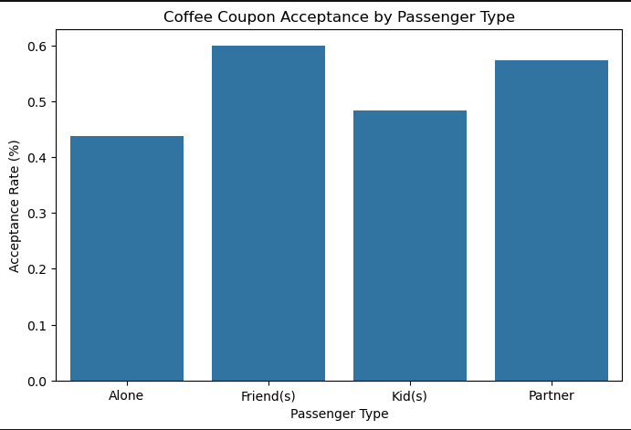
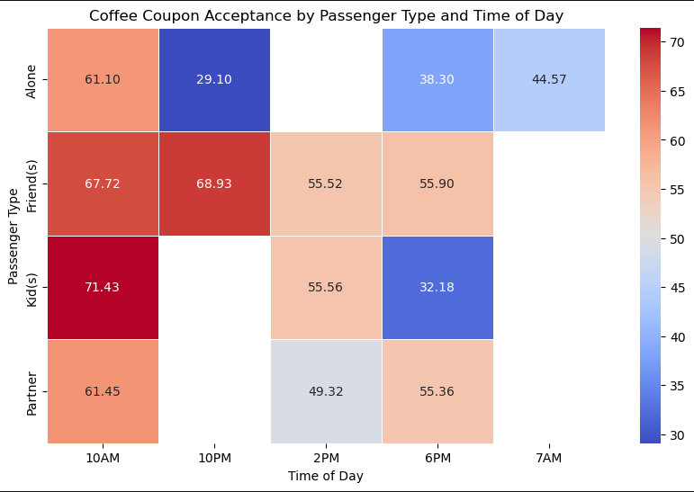
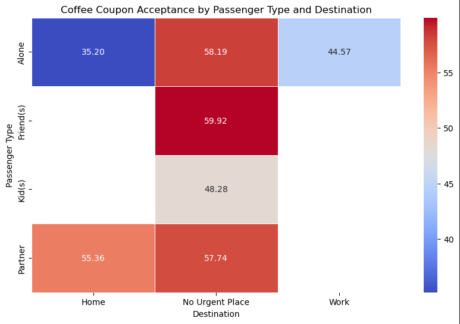

# Will The Customer Accept Coupon?

## Coupon Acceptance Analysis - Summary of Findings

### Overview

The goal of this project is to use visualizations and probability distributions to distinguish
between customers who accepted a driving coupon versus those that did not.

This analysis explores the characteristics of the drivers/passengers who accept bar coupons and coffee house coupons.

---

### Bar Coupons

#### Proportion of Bar Coupons Accepted:

- 41.00% of bar coupons were accepted.

#### Key findings About Bar Coupon Acceptance:

- Acceptance Rate for Drivers who visited the Bar 3 or Fewer times:
  - **52.7%**

- Acceptance Rate for Drivers who visited the Bar More than 3 times:
  - **76.8%**

- Acceptance Rate for Drivers over age 25 who go to bar once a month:
  - **69.5%**

- Acceptance Rate for Drivers who had passengers with no kids and not in farming, fishing or forestry:
  - **71.3%**

- Drivers with any of the following conditions had an **acceptance rate of 61.5%**,
  - who were not widowed and
    - had no kid passengers
OR
  - who went to bar more than once a month
OR
  - who went to cheap restaurants more than 4 times a month and income is less than 50K

#### Summary of Acceptance Rate for Bar Coupons:
- Drivers who go to bars more than once a month had significantly higher acceptance rates (~69%-71%).
- Younger drivers likely have more social lifestyles, making them more receptive to bar coupons.
- Drivers with incomes under $50K were more likely to accept bar coupons.
- Drivers in professions other than farming, fishing, or forestry had higher acceptance rates.
- Drivers with no kid passengers were much more likely to accept bar coupons.
- Drivers who were not widowed were more likely to accept bar coupons.
  
---
### Coffee House Coupons

#### Proportion of Coffee House Coupons Accepted:
- 50% of coffee house coupons were accepted.

#### Key Findings:
Coffee House Coupon Acceptance Rate by Passenger Type:

  - Drivers Alone : 43%
  - Drivers with Friend Passengers : 59%
  - Drivers with Kid Passengers : 48%
  - Drivers with Partners : 57%

Coffee House Coupon Acceptance Rate by Passenger Type and Time of Day:

  - Drivers with Friends have high acceptance rate
    - **Late Night (10PM): 68.9% acceptance(highest at night).**
    - Morning (10AM): 67.7% acceptance.
    - Afternoon (2PM): 55.5% acceptance.
    - Evening (6PM): 56% acceptance.

  - Drivers with Kids Are More Likely to Accept in the Morning or Afternoon
    - **Morning (10AM): 71.42% acceptance (highest for this group).**
    - Afternoon (2PM): 55.55% acceptance.
    - Evening (6PM): 32.18% acceptance (lowest).

  - Drivers with Partners Show Moderate Acceptance Across the Day
    - Morning (10AM): 61.44% acceptance.
    - Afternoon (2PM): 49.31% acceptance.
    - Evening (6PM): 55.35% acceptance.

  - Drivers Alone Have the Lowest Acceptance, Especially at Night
    - Morning (10AM): 61.09% acceptance.
    - Evening (6PM): 38.3% acceptance.
    - **Late Night (10PM): 29.1% acceptance (lowest of all groups).**

- Coffee House Coupon Acceptance Rate by Passenger Type and Destination:

  - Drivers alone accept coffee coupons across all destinations.
    - Home : 35.20%
    - No Urgent Place : 58.19%
    - Work : 44.57%
  - Drivers with friends 59.9% acceptance rates, but only when heading to No Urgent Place.
  - Drivers with  kids also show acceptance rate of 48.28%, only when heading to No Urgent Place.
  - Missing values indicate a lack of data points for some combinations like:
    - Drivers with friends heading to Work
    - Drivers with friends heading Home
    - Drivers with Kids heading Home
    - Drivers with Partners heading to Work

#### Summary of Acceptance Rate for Coffee House Coupons:

Coffee coupon acceptance is influenced by:

- Passenger Type
  - Driver with Friends had higher acceptance rate
  - Drivers Alone had the least acceptance rate

- Passenger type and Time of the Day:
  - Drivers with Friends have high acceptance rate during late night (10 PM)
  - Drivers with Kids have high acceptance rate during Morning(10 AM)

- Passenger Type and the Destination:
  - Driver Alone accept coupons across all destinations (Home, No Urgent Place and Work)

---
### Differences Between Those Who Accepted and Did Not Accept Coupons
### Bar Coupons
#### Drivers who accepted:
- Drivers who **frequently go to bars (more than once a month)** were more likely to accept coupons.
- Drivers **without kids** had a **higher acceptance rate** than those with kids.
- Younger drivers **(under 30)** had a **higher acceptance rate.**
- **Lower-income drivers (<$50K) were more likely** to accept bar coupons.

#### Drivers who did not accept:
- **Widowed drivers were less likely** to accept the coupon.
- **Older drivers were less likely** to accept the coupons.
- **Higher income drivers were less likely** to accept the coupons.

### Coffee House Coupons:
#### Drivers who accepted:
- **Drivers with friends were the most likely** to accept coffee coupons.
- **Drivers with kids have high acceptance rate** during Morning (10AM).
- **Driver with friends were most likely to accept coupons during late-night (10PM)**.
- **Drivers heading to 'No Urgent Place' had the highest acceptance rate,** indicating that people with flexible schedules are more open to making coffee stops.

#### Drivers who did not accept:
- Drivers alone were the least likely to accept coupons in the overall analysis.
---
### Next Steps & Recommendations
**For Business and Marketing Strategies:**

- **Target frequent visitors:** 
  - Offer personalized coupons to individuals who frequently visit coffee shops or bars.
- **Leverage social settings:** 
  - Promote group discounts or referral bonuses to encourage acceptance among those with friends or partners.
- **Optimize coupon distribution times:** 
  - Send coffee coupons in the morning (10AM) and late evening (10PM) when acceptance rates are highest.
- **Focus on lower-income demographics:** 
  - Since drivers earning less than $50K were more likely to accept coupons, businesses could provide tiered discounts or loyalty rewards for budget-conscious consumers.
- **Encourage spontaneous purchases:** 
  - Send push notifications or real-time alerts to drivers who are not heading to work or home, as they are more open to stopping at a coffee shop.

This analysis provides valuable insights into how businesses can tailor their coupon marketing strategies based on passenger behavior, income levels, and contextual factors.

### Project files
#### Link to notebook
[Coupon Acceptance Analysis](notebooks/required_assignment_5_1.ipynb)
#### Data
[Coupons Data](notebooks/required_assignment_5_1.ipynb)
